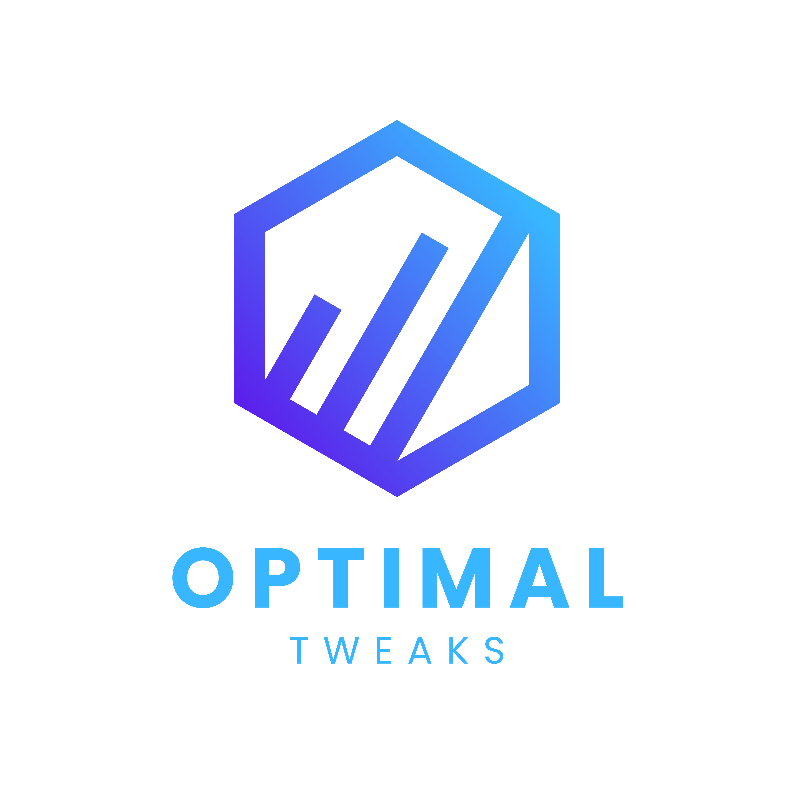

<p align="center">
  
</p>

<p align="center">
  A safety-first Windows 11 tuning utility with hardware-aware recommendations, reversible plans, guided onboarding, debloat controls, gaming profiles, maintenance, networking, software installation, and restore history.
</p>

<p align="center">
  <a href="https://github.com/unquerys/Optimal/releases/latest"></a>
  <a href="https://github.com/unquerys/Optimal/actions/workflows/release.yml"></a>
  
  
</p>

## Install

Open PowerShell and run:

```powershell
irm https://raw.githubusercontent.com/unquerys/Optimal/main/install.ps1 | iex
```

The script downloads the newest stable installer from GitHub Releases, verifies its published SHA-256 checksum, and opens the elevated Optimal installer. To inspect the installer script before running it:

```powershell
irm https://raw.githubusercontent.com/unquerys/Optimal/main/install.ps1
```

You can also download one of these files from the [latest release](https://github.com/unquerys/Optimal/releases/latest):

| Download | Use |
| --- | --- |
| `Optimal-Setup.exe` | Recommended custom installer with shortcut selection and uninstall support |
| `Optimal.exe` | Bundled standalone application |
| `Optimal-win-x64.zip` | Portable folder with the app and its release data |

Windows SmartScreen may show a warning because the current binaries are not code-signed. Verify the SHA-256 file from the same GitHub Release before running a download.

Both GitHub `.exe` downloads carry an embedded Windows administrator manifest, so opening either one requests UAC automatically. The setup download is recommended because it keeps the elevation path consistent through install and launch; users should never need to right-click **Run as administrator**.

## What Optimal includes

- 90 validated controls across privacy, detected-app debloat, Windows behavior, gaming, NVIDIA profiles, power, networking, maintenance, software, and repair categories.
- A smart current-user package scan that shows only installed matches from a reviewed optional-app catalog, never auto-selects removals, and uses the normal preview, restore-point, backup, and undo pipeline.
- An offline game library with 18 competitive and AAA profiles, real cover artwork, hardware-aware targets, copyable in-game settings, and reversible Windows/driver profile selection.
- Adapter, DNS, TCP/IP, link, gateway, MTU, latency, jitter, and packet-loss diagnostics, with explicit guidance for QoS and hardware-latency workflows.
- Hardware detection for CPU, GPU, storage type, Windows build, laptop state, and supported feature capabilities.
- Simple and advanced catalog modes, search, categories, explanations, warnings, and detected current state.
- Guided onboarding that builds a reviewable plan from detected hardware and your selected profile.
- A fresh restore point before every applied plan, registry backups, operation backups, a run journal, and supported reverts.
- No background optimization and no automatic changes at startup. Nothing runs until you review and confirm it in the UI.

Optimal intentionally excludes placebo or dangerous blanket presets: forced MTU, universal TCP registry packs, the QoS "20% bandwidth" myth, indiscriminate service disabling, repeated cache/prefetch purges, HPET/BCD timer recipes, silent MSI-mode changes, and automatic voltage, clock, RAM-timing, VBIOS, or firmware writes.

## Safety model

Optimal follows the same execution path for every applied plan:

1. Detect compatibility and current state.
2. Show the exact selected controls and exclusions.
3. Require explicit confirmation.
4. Create a fresh Windows restore point.
5. Capture registry and operation-specific backups.
6. Apply each operation with progress reporting.
7. Record results and restart requirements in run history.

The automatic debloat baseline protects Microsoft Store, Windows Security, drivers, application frameworks, and protected Windows shell components. Application removal can still become irreversible when Windows no longer retains a removed package, so review the plan carefully.

## Build from source

Requirements:

- Windows 11 x64
- .NET 9 SDK
- Inno Setup 6 for the installer build

```powershell
dotnet restore Optimal.sln
dotnet test Optimal.Tests\Optimal.Tests.csproj -c Release
powershell -NoProfile -ExecutionPolicy Bypass -File .\scripts\build-release.ps1
```

Release files are written to `artifacts`. The release script builds a self-contained Windows x64 application, runs tests, creates a portable ZIP, builds the installer when Inno Setup is available, and writes SHA-256 checksum files.

## Important notes

- Optimal requests administrator access because Windows restore points and system-wide controls require elevation.
- Results vary by hardware, drivers, router, workload, internet provider, and Windows version.
- NVIDIA profiles require NVIDIA Profile Inspector and compatible NVIDIA hardware.
- Third-party applications are installed from their publishers through WinGet and remain subject to publisher terms.
- Restart prompts are shown when selected controls require a restart.

## Documentation

- [Architecture](docs/architecture.md)
- [Distribution and release process](docs/distribution.md)
- [Manifest format](docs/manifest-format.md)
- [Safety layer](docs/safety-layer.md)
- [Optimization research](docs/optimization-research.md)
- [Optimal 1.0.3 release notes](docs/release-notes-v1.0.3.md)

## Community and support

[Join the Optimal Discord](https://discord.gg/U8KTvCDyuM) for updates, testing announcements, feature discussions, and premium feature news.

Report bugs through [GitHub Issues](https://github.com/unquerys/Optimal/issues). Do not include logs or screenshots that expose usernames, device names, network addresses, serial numbers, access tokens, or other personal information.
